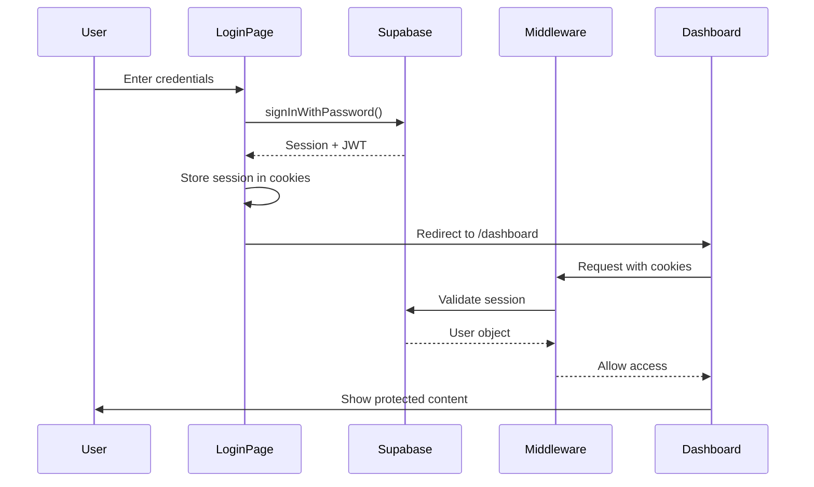
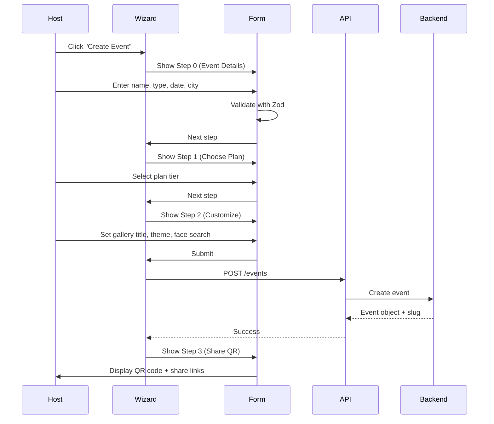
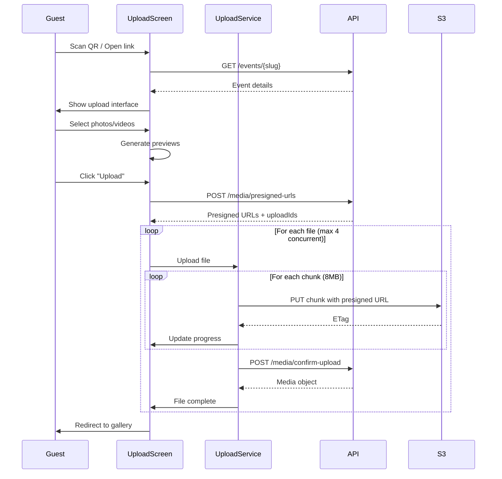
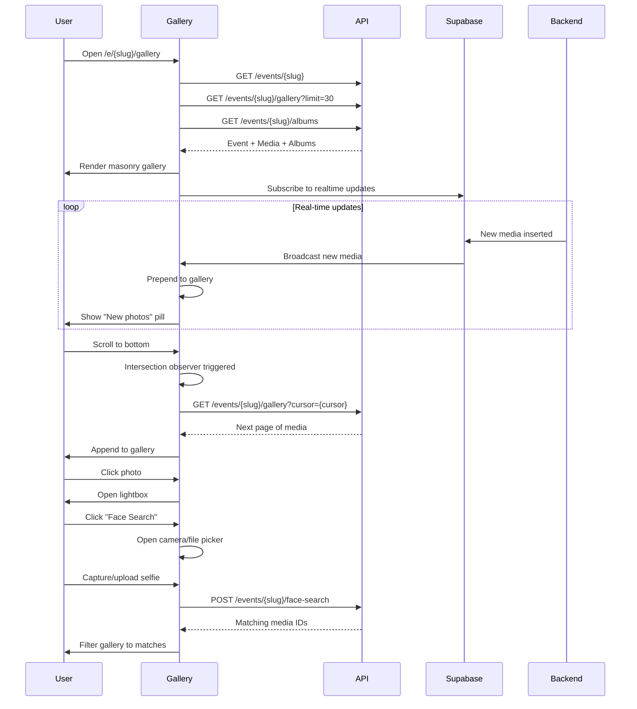

# Yaadein - Technical Flow Documentation

**Version:** 1.0  
**Last Updated:** 2026-07-04  
**Project:** Yaadein - QR-based Photo Sharing Platform for Events

---

## Table of Contents

1. [Executive Summary](#executive-summary)
2. [System Architecture](#system-architecture)
3. [Technology Stack](#technology-stack)
4. [Project Structure](#project-structure)
5. [Authentication & Authorization](#authentication--authorization)
6. [Core User Flows](#core-user-flows)
7. [API Architecture](#api-architecture)
8. [State Management](#state-management)
9. [Data Models](#data-models)
10. [Component Architecture](#component-architecture)
11. [Real-time Features](#real-time-features)
12. [File Upload System](#file-upload-system)
13. [Routing & Middleware](#routing--middleware)
14. [Performance Optimizations](#performance-optimizations)
15. [Security Considerations](#security-considerations)

---

## Executive Summary

**Yaadein** is a QR-based photo sharing platform designed for Indian weddings and celebrations. It enables event hosts to create events, generate QR codes, and allow guests to upload photos without requiring app downloads or account creation.

### Key Features
- **QR Code Sharing**: Instant event access via QR codes
- **Guest Upload**: No-login photo/video uploads from any device
- **AI Face Search**: Find photos by uploading a selfie
- **Real-time Gallery**: Live updates as guests upload
- **Chunked Uploads**: Reliable uploads even on poor venue Wi-Fi
- **Multi-tier Plans**: Starter (free) to Elite (₹9,999/event)

### Target Users
1. **Event Hosts**: Create and manage events, view galleries
2. **Guests**: Upload photos/videos via QR code
3. **Photographers** (future): Professional event management

---

## System Architecture

### High-Level Architecture

```
┌─────────────────────────────────────────────────────────────┐
│                     CLIENT (Next.js 16)                      │
│  ┌────────────────────────────────────────────────────────┐ │
│  │  Pages & Components (React 19)                         │ │
│  │  - Landing, Login, Dashboard, Event Creation, Gallery  │ │
│  └────────────────────────────────────────────────────────┘ │
│  ┌────────────────────────────────────────────────────────┐ │
│  │  State Management                                       │ │
│  │  - Zustand (Upload State)                              │ │
│  │  - React Query (Server State)                          │ │
│  └────────────────────────────────────────────────────────┘ │
│  ┌────────────────────────────────────────────────────────┐ │
│  │  API Layer                                              │ │
│  │  - API Client (Fetch wrapper)                          │ │
│  │  - Service Layer (Events, Media, Auth)                 │ │
│  └────────────────────────────────────────────────────────┘ │
└─────────────────────────────────────────────────────────────┘
                            │
                            │ HTTPS
                            ▼
┌─────────────────────────────────────────────────────────────┐
│                  SUPABASE (Auth & Realtime)                  │
│  ┌────────────────────────────────────────────────────────┐ │
│  │  Authentication (OAuth, Email/Password)                │ │
│  │  Realtime Subscriptions (Postgres Changes)             │ │
│  └────────────────────────────────────────────────────────┘ │
└─────────────────────────────────────────────────────────────┘
                            │
                            │ JWT Bearer Token
                            ▼
┌─────────────────────────────────────────────────────────────┐
│                    BACKEND API (External)                    │
│  ┌────────────────────────────────────────────────────────┐ │
│  │  REST API Endpoints                                     │ │
│  │  - /events (CRUD)                                       │ │
│  │  - /media (Upload, Gallery, Face Search)               │ │
│  │  - /auth (Profile)                                      │ │
│  └────────────────────────────────────────────────────────┘ │
│  ┌────────────────────────────────────────────────────────┐ │
│  │  Business Logic                                         │ │
│  │  - Event Management                                     │ │
│  │  - S3 Multipart Upload Orchestration                   │ │
│  │  - AI Face Recognition                                  │ │
│  │  - Media Processing Pipeline                            │ │
│  └────────────────────────────────────────────────────────┘ │
└─────────────────────────────────────────────────────────────┘
                            │
                            ▼
┌─────────────────────────────────────────────────────────────┐
│                    STORAGE & DATABASE                        │
│  ┌──────────────────┐  ┌──────────────────┐                │
│  │  AWS S3          │  │  PostgreSQL      │                │
│  │  (Media Storage) │  │  (Metadata)      │                │
│  └──────────────────┘  └──────────────────┘                │
└─────────────────────────────────────────────────────────────┘
```

### Architecture Patterns

1. **Frontend Architecture**: Next.js App Router with Server Components
2. **API Communication**: RESTful API with JWT authentication
3. **State Management**: Hybrid (Zustand for client state, React Query for server state)
4. **Real-time**: Supabase Realtime (Postgres CDC)
5. **File Upload**: Direct-to-S3 multipart uploads with presigned URLs
6. **Authentication**: Supabase Auth with session management

---

## Technology Stack

### Frontend Core
- **Framework**: Next.js 16.2.9 (App Router)
- **React**: 19.2.4
- **TypeScript**: 5.x
- **Styling**: Tailwind CSS 4.x

### State Management
- **Zustand**: 5.0.14 (Client state - upload progress)
- **React Query**: 5.101.1 (Server state - API data)
- **React Hook Form**: 7.80.0 (Form state)

### UI Components
- **Radix UI**: Headless accessible components
  - Avatar, Checkbox, Dialog, Popover, Separator, Switch, Tooltip
- **Framer Motion**: 12.42.0 (Animations)
- **Lucide React**: 1.21.0 (Icons)
- **Sonner**: 2.0.7 (Toast notifications)

### Authentication & Backend
- **Supabase**: 2.108.2 (Auth + Realtime)
  - `@supabase/ssr`: 0.12.0 (SSR support)
  - `@supabase/supabase-js`: 2.108.2 (Client SDK)

### Validation & Forms
- **Zod**: 4.4.3 (Schema validation)
- **@hookform/resolvers**: 5.4.0 (Form validation integration)

### Utilities
- **date-fns**: 4.4.0 (Date formatting)
- **qrcode**: 1.5.4 (QR code generation)
- **html2canvas**: 1.4.1 (Screenshot/download)
- **class-variance-authority**: 0.7.1 (Component variants)
- **clsx** + **tailwind-merge**: Conditional styling

### Development Tools
- **ESLint**: 9.x (Linting)
- **Bundle Analyzer**: Performance analysis

---

## Project Structure

```
yaadein-ui/
├── src/
│   ├── app/                          # Next.js App Router pages
│   │   ├── page.tsx                  # Landing page
│   │   ├── layout.tsx                # Root layout
│   │   ├── globals.css               # Global styles
│   │   ├── login/                    # Authentication
│   │   │   └── page.tsx
│   │   ├── signup/
│   │   │   └── page.tsx
│   │   ├── dashboard/                # Protected routes
│   │   │   ├── page.tsx              # Event list
│   │   │   ├── layout.tsx            # Dashboard layout
│   │   │   └── create-event/
│   │   │       └── page.tsx          # Event creation wizard
│   │   ├── e/[slug]/                 # Public event pages
│   │   │   ├── page.tsx              # Guest upload screen
│   │   │   └── gallery/
│   │   │       └── page.tsx          # Gallery view
│   │   └── pricing/
│   │       └── page.tsx
│   │
│   ├── components/                   # Component library (Atomic Design)
│   │   ├── atoms/                    # Basic building blocks
│   │   │   ├── Avatar.tsx
│   │   │   ├── Badge.tsx
│   │   │   ├── Button.tsx
│   │   │   ├── Card.tsx
│   │   │   ├── Input.tsx
│   │   │   ├── Spinner.tsx
│   │   │   └── ...
│   │   ├── molecules/                # Composite components
│   │   │   ├── AlbumChip.tsx
│   │   │   ├── ConsentBanner.tsx
│   │   │   ├── EventListCard.tsx
│   │   │   ├── FormField.tsx
│   │   │   ├── PhotoThumbnail.tsx
│   │   │   ├── UploadDropzone.tsx
│   │   │   └── ...
│   │   ├── organisms/                # Complex components
│   │   │   ├── CreateEventWizard.tsx
│   │   │   ├── GuestUploadScreen.tsx
│   │   │   ├── GalleryScreen.tsx
│   │   │   ├── Navbar.tsx
│   │   │   ├── Footer.tsx
│   │   │   └── create-event/
│   │   │       ├── Step0EventDetails.tsx
│   │   │       ├── Step1ChoosePlan.tsx
│   │   │       ├── Step2CustomizeGallery.tsx
│   │   │       └── Step3ShareQR.tsx
│   │   ├── providers/
│   │   │   └── QueryProvider.tsx     # React Query setup
│   │   └── ui/                       # Shadcn/Radix wrappers
│   │       ├── accordion.tsx
│   │       ├── button.tsx
│   │       ├── calendar.tsx
│   │       └── ...
│   │
│   ├── lib/                          # Core utilities
│   │   ├── api/                      # API layer
│   │   │   ├── client.ts             # Base API client
│   │   │   ├── auth.service.ts       # Auth endpoints
│   │   │   ├── events.service.ts     # Event endpoints
│   │   │   ├── media.service.ts      # Media endpoints
│   │   │   └── upload.service.ts     # Upload orchestration
│   │   ├── supabase/                 # Supabase clients
│   │   │   ├── client.ts             # Browser client
│   │   │   ├── server.ts             # Server client
│   │   │   └── middleware.ts         # Session management
│   │   ├── realtime/
│   │   │   └── gallery.realtime.ts   # Realtime subscriptions
│   │   ├── schemas/
│   │   │   └── createEvent.schema.ts # Zod schemas
│   │   ├── queryKeys.ts              # React Query keys
│   │   └── utils.ts                  # Helper functions
│   │
│   ├── stores/                       # Zustand stores
│   │   └── upload.store.ts           # Upload state management
│   │
│   ├── types/                        # TypeScript definitions
│   │   └── api/
│   │       ├── auth.types.ts
│   │       ├── events.types.ts
│   │       ├── gallery.types.ts
│   │       └── media.types.ts
│   │
│   ├── content/                      # Static content
│   │   ├── landing.content.ts
│   │   └── plans.content.ts
│   │
│   ├── styles/
│   │   └── tokens.css                # Design tokens
│   │
│   ├── middleware.ts                 # Next.js middleware (auth)
│   └── env.ts                        # Environment validation
│
├── public/                           # Static assets
├── .env.local                        # Environment variables
├── next.config.ts                    # Next.js configuration
├── tailwind.config.ts                # Tailwind configuration
├── tsconfig.json                     # TypeScript configuration
└── package.json                      # Dependencies
```

### Design Patterns

1. **Atomic Design**: Components organized by complexity (atoms → molecules → organisms)
2. **Service Layer**: API calls abstracted into service modules
3. **Type Safety**: Comprehensive TypeScript types for all data structures
4. **Separation of Concerns**: Clear boundaries between UI, business logic, and data
5. **Content Management**: Static content separated from components


---

## Authentication & Authorization

### Authentication Flow



### Implementation Details

#### 1. Supabase Client Setup

**Browser Client** ([`src/lib/supabase/client.ts`](src/lib/supabase/client.ts))
```typescript
import { createBrowserClient } from "@supabase/ssr";

export function createClient() {
  return createBrowserClient(
    env.NEXT_PUBLIC_SUPABASE_URL,
    env.NEXT_PUBLIC_SUPABASE_ANON_KEY
  );
}
```

**Server Client** ([`src/lib/supabase/server.ts`](src/lib/supabase/server.ts))
- Uses Next.js cookies API
- Server-side session validation
- Cookie-based session management

#### 2. Login Flow

**Login Page** ([`src/app/login/page.tsx`](src/app/login/page.tsx))
- Email/Password authentication
- Google OAuth integration
- Form validation with Zod
- Error handling with toast notifications

**Key Features:**
- Client-side form validation
- OAuth redirect handling
- Session persistence in cookies
- Automatic redirect to dashboard on success

#### 3. Middleware Protection

**Middleware** ([`src/middleware.ts`](src/middleware.ts))
```typescript
export async function middleware(request: NextRequest) {
  const { supabaseResponse, user } = await updateSession(request);
  const path = request.nextUrl.pathname;

  // Protected routes
  const isDashboard = path.startsWith("/dashboard");
  const isManageEvent = /^\/event\/[^/]+\/manage/.test(path);

  // Redirect to login if not authenticated
  if ((isDashboard || isManageEvent) && !user) {
    const loginUrl = request.nextUrl.clone();
    loginUrl.pathname = "/login";
    loginUrl.searchParams.set("next", path);
    return NextResponse.redirect(loginUrl);
  }

  return supabaseResponse;
}
```

**Protected Routes:**
- `/dashboard/*` - Event management
- `/event/*/manage` - Event administration

**Public Routes:**
- `/` - Landing page
- `/e/[slug]` - Guest upload (no auth required)
- `/e/[slug]/gallery` - Gallery view (no auth required)
- `/login`, `/signup` - Authentication pages

#### 4. API Authentication

**API Client** ([`src/lib/api/client.ts`](src/lib/api/client.ts))
- Automatic JWT injection from Supabase session
- Bearer token in Authorization header
- Auto-redirect on 401 Unauthorized

**Session Management:**
1. **Session Storage**: HTTP-only cookies (managed by Supabase)
2. **Session Refresh**: Automatic via middleware
3. **Token Expiry**: Handled by Supabase SDK
4. **Logout**: Clear session and redirect to login

---

## Core User Flows

### 1. Event Creation Flow



#### Implementation

**Wizard Component** ([`src/components/organisms/CreateEventWizard.tsx`](src/components/organisms/CreateEventWizard.tsx))

**State Management:**
- React Hook Form for form state
- Step-based navigation (0-3)
- Validation per step before proceeding

**Steps:**
1. **Step 0 - Event Details**
   - Event name (3-100 chars)
   - Event type (wedding, birthday, graduation, corporate, engagement, other)
   - Date picker
   - City

2. **Step 1 - Choose Plan**
   - Plan cards (Starter, Basic, Premium, Elite)
   - Feature comparison
   - Price display (₹0 - ₹9,999)

3. **Step 2 - Customize Gallery**
   - Gallery title
   - Color theme selection (ivory, rose, sage, midnight, white)
   - Face search toggle

4. **Step 3 - Share QR**
   - QR code display
   - Share URL
   - WhatsApp share button
   - Download QR code

**Validation Schema** ([`src/lib/schemas/createEvent.schema.ts`](src/lib/schemas/createEvent.schema.ts))
```typescript
export const createEventSchema = z.object({
  name: z.string().min(3).max(100),
  type: z.enum(['wedding', 'birthday', 'graduation', 'corporate', 'engagement', 'other']),
  date: z.string().datetime(),
  city: z.string().min(2),
  plan: z.enum(['starter', 'basic', 'premium', 'elite']),
  galleryTitle: z.string().min(3),
  colorTheme: z.enum(['ivory', 'rose', 'sage', 'midnight', 'white']),
  enableFaceSearch: z.boolean(),
});
```

---

### 2. Guest Upload Flow



#### Implementation

**Upload Screen** ([`src/components/organisms/GuestUploadScreen.tsx`](src/components/organisms/GuestUploadScreen.tsx))

**Key Features:**
1. **File Selection**
   - Drag & drop zone
   - File input
   - Preview generation with URL.createObjectURL()

2. **Consent Banner** (if face search enabled)
   - GDPR-compliant consent
   - Stored per upload session

3. **Upload Progress**
   - Per-file progress bars
   - Status indicators (uploading, processing, ready, error)
   - Thumbnail previews

4. **Upload Service** ([`src/lib/api/upload.service.ts`](src/lib/api/upload.service.ts))

**Chunked Upload Strategy:**
```typescript
const CHUNK_SIZE = 8 * 1024 * 1024; // 8 MB
const MAX_CONCURRENT_UPLOADS = 4;
const MAX_CHUNK_RETRIES = 5;
```

**Upload Process:**
1. Request presigned URLs for all files (batch)
2. Upload files with max 4 concurrent uploads
3. Each file split into 8MB chunks
4. Each chunk uploaded with exponential backoff retry
5. Confirm upload with ETags
6. Generate idempotency key to prevent duplicates

**Idempotency:**
```typescript
async function generateIdempotencyKey(
  filename: string,
  eventId: string,
  size: number,
  lastModified: number
): Promise<string> {
  const raw = `${filename}:${eventId}:${size}:${lastModified}`;
  const encoded = new TextEncoder().encode(raw);
  const hashBuffer = await crypto.subtle.digest('SHA-256', encoded);
  return hashArray.map(b => b.toString(16).padStart(2, '0')).join('');
}
```

**State Management:**
- Zustand store for upload progress ([`src/stores/upload.store.ts`](src/stores/upload.store.ts))
- Per-file state tracking
- Progress updates
- Error handling

---

### 3. Gallery Viewing Flow



#### Implementation

**Gallery Screen** ([`src/components/organisms/GalleryScreen.tsx`](src/components/organisms/GalleryScreen.tsx))

**Key Features:**

1. **Infinite Scroll**
   - React Query infinite query
   - Intersection Observer for trigger
   - Cursor-based pagination
   - 30 items per page

2. **Real-time Updates** ([`src/lib/realtime/gallery.realtime.ts`](src/lib/realtime/gallery.realtime.ts))
   - Supabase Realtime subscription
   - Postgres CDC (Change Data Capture)
   - Live photo/video updates
   - Deduplication with existing data

3. **Album Filtering**
   - Chip-based navigation
   - Filter by album ID
   - "All" view

4. **Search**
   - Debounced search (400ms)
   - Server-side search
   - Search by keywords

5. **Face Search**
   - Camera capture or file upload
   - POST to `/events/{eventId}/face-search`
   - Filter gallery to matching photos
   - Visual highlight with ring

6. **Lightbox**
   - Full-screen viewer
   - Keyboard navigation (←/→/Esc)
   - Download button
   - Video playback support

7. **Slideshow**
   - Auto-play mode
   - Configurable interval
   - Full-screen

**State Management:**
- React Query for server state
- Local state for UI (lightbox, filters)
- Real-time state merged with query data

**Performance:**
- Dynamic imports for heavy components
- Image lazy loading
- Masonry layout (CSS columns)
- Reduced motion support

---

## API Architecture

### API Client

**Base Client** ([`src/lib/api/client.ts`](src/lib/api/client.ts))

**Features:**
- Automatic JWT injection
- Error handling with custom `ApiError` class
- 401 auto-redirect to login
- Query parameter serialization
- JSON request/response handling

**Methods:**
```typescript
export const api = {
  get: <T>(path: string, options?: RequestOptions) => fetchApi<T>(path, { ...options, method: 'GET' }),
  post: <T>(path: string, data?: unknown, options?: RequestOptions) => fetchApi<T>(path, { ...options, method: 'POST', body: JSON.stringify(data) }),
  put: <T>(path: string, data?: unknown, options?: RequestOptions) => fetchApi<T>(path, { ...options, method: 'PUT', body: JSON.stringify(data) }),
  patch: <T>(path: string, data?: unknown, options?: RequestOptions) => fetchApi<T>(path, { ...options, method: 'PATCH', body: JSON.stringify(data) }),
  delete: <T>(path: string, options?: RequestOptions) => fetchApi<T>(path, { ...options, method: 'DELETE' }),
};
```

### Service Layer

#### 1. Events Service ([`src/lib/api/events.service.ts`](src/lib/api/events.service.ts))

```typescript
export const eventsService = {
  createEvent: (payload: CreateEventPayload) => 
    api.post<Event>('/events', payload),
    
  getEvent: (idOrSlug: string) => 
    api.get<Event>(`/events/${idOrSlug}`),
    
  listEvents: () => 
    api.get<Event[]>('/events'),
    
  getEventQR: (eventId: string) => 
    api.get<{ qrUrl: string; shareUrl: string; whatsappUrl: string }>(`/events/${eventId}/qr`),
};
```

#### 2. Media Service ([`src/lib/api/media.service.ts`](src/lib/api/media.service.ts))

```typescript
export const mediaService = {
  requestPresignedUrls: (req: PresignedUrlRequest) => 
    api.post<PresignedUrlResponse>('/media/presigned-urls', req),
    
  confirmUpload: (payload: ConfirmUploadPayload) => 
    api.post<Media>('/media/confirm-upload', payload),
    
  getGallery: (eventId: string, params) => 
    api.get<GalleryResponse>(`/events/${eventId}/gallery`, { params }),

  getAlbums: (eventId: string) =>
    api.get<Album[]>(`/events/${eventId}/albums`),

  faceSearch: (eventId: string, imageFile: File) => {
    const form = new FormData();
    form.append('image', imageFile);
    return api.post<{ mediaIds: string[] }>(`/events/${eventId}/face-search`, form);
  },
    
  deleteMedia: (mediaId: string) => 
    api.delete<void>(`/media/${mediaId}`),
};
```

#### 3. Auth Service ([`src/lib/api/auth.service.ts`](src/lib/api/auth.service.ts))

```typescript
export const authService = {
  getUserProfile: () => 
    api.get<UserProfile>('/auth/profile'),
    
  updateProfile: (data: Partial<UserProfile>) => 
    api.patch<UserProfile>('/auth/profile', data),
};
```

### API Endpoints (Backend Contract)

#### Events

| Method | Endpoint | Description | Auth |
|--------|----------|-------------|------|
| POST | `/events` | Create new event | Required |
| GET | `/events` | List user's events | Required |
| GET | `/events/{idOrSlug}` | Get event details | Public |
| GET | `/events/{eventId}/qr` | Get QR code data | Required |
| GET | `/events/{eventId}/gallery` | Get gallery media | Public |
| GET | `/events/{eventId}/albums` | Get event albums | Public |

#### Media

| Method | Endpoint | Description | Auth |
|--------|----------|-------------|------|
| POST | `/media/presigned-urls` | Request S3 upload URLs | Public |
| POST | `/media/confirm-upload` | Confirm upload completion | Public |
| POST | `/events/{eventId}/face-search` | Search by face | Public |
| DELETE | `/media/{mediaId}` | Delete media | Required |

#### Auth

| Method | Endpoint | Description | Auth |
|--------|----------|-------------|------|
| GET | `/auth/profile` | Get user profile | Required |
| PATCH | `/auth/profile` | Update profile | Required |

---

## State Management

### 1. Server State (React Query)

**Setup** ([`src/components/providers/QueryProvider.tsx`](src/components/providers/QueryProvider.tsx))

**Query Keys** ([`src/lib/queryKeys.ts`](src/lib/queryKeys.ts))
```typescript
export const queryKeys = {
  events: {
    all: ['events'] as const,
    list: () => [...queryKeys.events.all, 'list'] as const,
    detail: (id: string) => [...queryKeys.events.all, 'detail', id] as const,
  },
  gallery: {
    all: ['gallery'] as const,
    list: (eventId: string, filters: { albumId?: string; search?: string }) => 
      [...queryKeys.gallery.all, 'list', eventId, filters] as const,
  },
};
```

**Usage Example:**
```typescript
const { data, fetchNextPage, hasNextPage } = useInfiniteQuery({
  queryKey: queryKeys.gallery.list(event.id, { albumId, search }),
  queryFn: ({ pageParam }) =>
    mediaService.getGallery(event.id, {
      limit: 30,
      cursor: pageParam,
      albumId,
      search,
    }),
  initialPageParam: undefined,
  getNextPageParam: (lastPage) => lastPage.nextCursor,
});
```

### 2. Client State (Zustand)

**Upload Store** ([`src/stores/upload.store.ts`](src/stores/upload.store.ts))

```typescript
interface FileUploadState {
  file: File;
  eventId: string;
  progress: number;
  status: MediaStatus;
  error?: string;
  media?: Media;
}

interface UploadStore {
  uploads: Record<string, FileUploadState>;
  addFiles: (files: File[], eventId: string) => string[];
  updateProgress: (fileId: string, progress: number) => void;
  setStatus: (fileId: string, status: MediaStatus, media?: Media, error?: string) => void;
  reset: () => void;
}
```

**Usage:**
```typescript
const { uploads, addFiles, updateProgress, setStatus } = useUploadStore();

// Add files
const ids = addFiles(selectedFiles, event.id);

// Update progress
updateProgress(ids[0], 50);

// Set status
setStatus(ids[0], 'ready', mediaObject);
```

### 3. Form State (React Hook Form)

**Event Creation Form:**
```typescript
const methods = useForm<CreateEventFormData>({
  resolver: zodResolver(createEventSchema),
  defaultValues: {
    name: "",
    city: "",
    plan: "starter",
    galleryTitle: "",
    colorTheme: "ivory",
    enableFaceSearch: false,
  },
  mode: "onChange",
});
```

**Features:**
- Zod schema validation
- Step-based validation
- Error messages
- Controlled inputs


---

## Data Models

### Event

```typescript
export type EventType = 'wedding' | 'birthday' | 'graduation' | 'corporate' | 'engagement' | 'other';
export type EventStatus = 'active' | 'expired' | 'archived';
export type PlanTier = 'starter' | 'basic' | 'premium' | 'elite';

export interface Event {
  id: string;
  slug: string;
  name: string;
  type: EventType;
  date: string; // ISO string
  city: string;
  coverPhotoUrl?: string;
  status: EventStatus;
  plan: PlanTier;
  photoCount: number;
  videoCount: number;
  guestCount: number;
  expiresAt: string;
  createdAt: string;
  enableFaceSearch?: boolean;
  shareUrl?: string;
}
```

### Media

```typescript
export type MediaStatus = 'uploading' | 'processing' | 'ready' | 'rejected' | 'error';
export type MediaType = 'photo' | 'video';

export interface Media {
  id: string;
  eventId: string;
  uploadedBy: string;
  url: string;
  thumbnailUrl: string;
  type: MediaType;
  status: MediaStatus;
  sizeBytes: number;
  width?: number;
  height?: number;
  duration?: number;
  albumIds: string[];
  faceEmbeddingId?: string;
  createdAt: string;
}
```

### Album

```typescript
export interface Album {
  id: string;
  name: string;
  emoji: string;
  mediaCount: number;
}
```

### Gallery Response

```typescript
export interface GalleryResponse {
  media: Media[];
  albums: Album[];
  totalCount: number;
  nextCursor?: string;
}
```

### Upload Types

```typescript
export interface PresignedUrlRequest {
  eventId: string;
  files: Array<{
    filename: string;
    mimeType: string;
    sizeBytes: number;
  }>;
}

export interface PresignedUrlResponse {
  uploads: Array<{
    fileId: string;
    uploadId: string;
    partUrls: string[];
    confirmUrl: string;
    chunkSize: number;
  }>;
}

export interface ConfirmUploadPayload {
  fileId: string;
  uploadId: string;
  etags: string[];
  idempotencyKey: string;
  faceConsent: boolean;
}
```

### Plan Content

```typescript
export interface PlanContent {
  id: string;
  name: string;
  price: number;
  priceUnit: string;
  photos: string;
  videos: string;
  retentionDays: string;
  features: string[];
  infraCost: number;
  color: string;
  storageGB: number;
  tag: string | null;
  isRecommended?: boolean;
}
```

**Plan Tiers:**
- **Starter**: Free, 500 photos, 90 days retention
- **Basic**: ₹2,499, 2,000 photos + 50 videos, 180 days
- **Premium**: ₹4,999, Unlimited, 365 days (Most Popular)
- **Elite**: ₹9,999, Unlimited 4K, Lifetime

---

## Component Architecture

### Atomic Design Structure

#### Atoms (Basic Building Blocks)
- **Avatar**: User/guest avatars with fallback
- **Badge**: Status indicators (Live, Active, etc.)
- **Button**: Primary, secondary, ghost variants
- **Card**: Container with shadow and border
- **Input**: Text input with icons
- **Spinner**: Loading indicator
- **Skeleton**: Loading placeholders
- **ProgressBar**: Upload progress
- **QRCodeFrame**: QR code display with frame
- **MotifBackground**: Decorative background patterns

#### Molecules (Composite Components)
- **AlbumChip**: Filterable album tags with emoji
- **ConsentBanner**: GDPR consent for face search
- **EventListCard**: Event preview card with stats
- **FormField**: Input + label + error message
- **PhotoThumbnail**: Image with status overlay
- **UploadDropzone**: Drag & drop file picker
- **LiveUpdatePill**: "New photos" notification
- **StepIndicator**: Multi-step progress indicator
- **PlanCard**: Pricing plan display card
- **TestimonialCard**: Customer testimonial

#### Organisms (Complex Components)
- **CreateEventWizard**: Multi-step event creation
- **GuestUploadScreen**: Complete upload interface
- **GalleryScreen**: Full gallery with filters
- **Navbar**: Site navigation with auth state
- **Footer**: Site footer with links
- **DashboardSidebar**: Dashboard navigation
- **DashboardBottomNav**: Mobile bottom navigation
- **HeroSection**: Landing page hero
- **HowItWorksSection**: Feature explanation
- **FeatureSection**: Feature highlights
- **TestimonialsSection**: Customer testimonials
- **PricingTabs**: Plan comparison

### Component Patterns

1. **Server Components** (Default)
   - Used for static content
   - Data fetching at build/request time
   - No client-side JavaScript

2. **Client Components** (`"use client"`)
   - Interactive components
   - State management
   - Event handlers

3. **Dynamic Imports**
   - Heavy components loaded on-demand
   - Reduces initial bundle size
   ```typescript
   const GalleryScreen = dynamic(() => 
     import("@/components/organisms/GalleryScreen").then(m => m.GalleryScreen), 
     { ssr: false }
   );
   ```

4. **Compound Components**
   - Card + CardContent
   - Dialog + DialogContent + DialogTitle

### Design System

**Color Tokens:**
- Brand Primary: `#C4622D` (Orange)
- Brand Secondary: `#D4A853` (Gold)
- Surface Primary: `#FFFFFF`
- Surface Secondary: `#F5F5F5`
- Text Primary: `#1A1A2E`
- Text Secondary: `#6B6567`

**Typography:**
- Heading Font: Display/Serif
- Body Font: Sans-serif
- Monospace: Code blocks

**Spacing Scale:**
- Base unit: 4px
- Scale: 0.5, 1, 1.5, 2, 3, 4, 6, 8, 12, 16, 24, 32

---

## Real-time Features

### Supabase Realtime Integration

**Subscription Setup** ([`src/lib/realtime/gallery.realtime.ts`](src/lib/realtime/gallery.realtime.ts))

```typescript
export function subscribeToGallery(
  eventId: string, 
  onNewMedia: (media: Media) => void
): () => void {
  const supabase = createBrowserClient(
    process.env.NEXT_PUBLIC_SUPABASE_URL!,
    process.env.NEXT_PUBLIC_SUPABASE_ANON_KEY!
  );

  const channel = supabase
    .channel(`gallery-${eventId}`)
    .on('postgres_changes', {
      event: 'INSERT',
      schema: 'public',
      table: 'media',
      filter: `event_id=eq.${eventId}`,
    }, (payload) => {
      onNewMedia(payload.new as Media);
    })
    .subscribe();

  return () => supabase.removeChannel(channel);
}
```

**Usage in Gallery:**
```typescript
React.useEffect(() => {
  const unsubscribe = subscribeToGallery(event.id, (media) => {
    setRealtimeMedia((prev) => [media, ...prev]);
    setNewMediaCount((c) => c + 1);
  });
  return unsubscribe;
}, [event.id]);
```

**Features:**
- Live photo/video updates
- "New photos" notification pill
- Automatic gallery refresh
- Deduplication with existing data

**Architecture:**
```
Backend → PostgreSQL → Supabase Realtime → WebSocket → Client
```

**How it Works:**
1. Backend inserts new media record into PostgreSQL
2. Supabase detects INSERT via Postgres CDC
3. Supabase broadcasts change via WebSocket
4. Client receives update and prepends to gallery
5. User sees "X new photos" notification

---

## File Upload System

### Chunked Multipart Upload Architecture

```
┌─────────────────────────────────────────────────────────────┐
│                    UPLOAD FLOW                               │
└─────────────────────────────────────────────────────────────┘

1. Request Phase
   Client → Backend: POST /media/presigned-urls
   Backend → S3: Initiate multipart upload
   Backend → Client: Return presigned URLs for each part

2. Upload Phase (Parallel)
   For each file (max 4 concurrent):
     For each chunk (8MB):
       Client → S3: PUT chunk with presigned URL
       S3 → Client: ETag
       (Retry with exponential backoff on failure)

3. Confirmation Phase
   Client → Backend: POST /media/confirm-upload
   Backend → S3: Complete multipart upload
   Backend → Database: Insert media record
   Backend → Client: Media object
```

### Implementation Details

**Upload Service** ([`src/lib/api/upload.service.ts`](src/lib/api/upload.service.ts))

**Configuration:**
```typescript
const CHUNK_SIZE = 8 * 1024 * 1024; // 8 MB
const MAX_CONCURRENT_UPLOADS = 4;
const MAX_CHUNK_RETRIES = 5;
```

**Key Functions:**

1. **Chunk Upload with Retry**
```typescript
async function uploadChunkWithRetry(
  partUrl: string,
  chunk: Blob,
  attempt = 0
): Promise<string> {
  try {
    const response = await fetch(partUrl, {
      method: 'PUT',
      body: chunk,
      headers: { 'Content-Type': 'application/octet-stream' },
    });
    
    const etag = response.headers.get('ETag');
    return etag.replace(/"/g, '');
  } catch (error) {
    if (attempt >= MAX_CHUNK_RETRIES - 1) throw error;
    
    const delayMs = Math.pow(2, attempt) * 1000; // Exponential backoff
    await new Promise(resolve => setTimeout(resolve, delayMs));
    return uploadChunkWithRetry(partUrl, chunk, attempt + 1);
  }
}
```

2. **Concurrency Control (Semaphore)**
```typescript
function createSemaphore(limit: number) {
  let active = 0;
  const queue: Array<() => void> = [];

  const acquire = (): Promise<void> =>
    new Promise((resolve) => {
      if (active < limit) {
        active++;
        resolve();
      } else {
        queue.push(() => {
          active++;
          resolve();
        });
      }
    });

  const release = () => {
    active--;
    const next = queue.shift();
    if (next) next();
  };

  return { acquire, release };
}
```

3. **Main Upload Orchestrator**
```typescript
export async function uploadFiles(params: UploadFilesParams): Promise<void> {
  const { eventId, files, faceConsent, onProgress, onFileComplete, onError } = params;

  // Step 1: Request presigned URLs for ALL files
  const { uploads } = await mediaService.requestPresignedUrls({
    eventId,
    files: files.map(f => ({
      filename: f.name,
      mimeType: f.type,
      sizeBytes: f.size,
    })),
  });

  // Step 2: Upload with concurrency control
  const semaphore = createSemaphore(MAX_CONCURRENT_UPLOADS);

  const uploadTasks = files.map((file, fileIndex) => async () => {
    await semaphore.acquire();
    try {
      const media = await uploadSingleFile(
        file,
        fileIndex,
        uploads[fileIndex],
        faceConsent,
        onProgress
      );
      onFileComplete(fileIndex, media);
    } catch (error) {
      onError(fileIndex, error);
    } finally {
      semaphore.release();
    }
  });

  await Promise.all(uploadTasks.map(task => task()));
}
```

**Benefits:**
- **Reliability**: Automatic retry with exponential backoff (1s, 2s, 4s, 8s, 16s)
- **Performance**: Parallel uploads with concurrency control
- **Progress**: Real-time progress updates per file
- **Resilience**: Works on poor network conditions
- **Idempotency**: SHA-256 hash prevents duplicate uploads

**Retry Strategy:**
- Max 5 retries per chunk
- Exponential backoff: 2^attempt * 1000ms
- Independent retry per chunk (one failed chunk doesn't block others)

---

## Routing & Middleware

### Route Structure

```
/                           # Landing page (public)
/login                      # Login page (public)
/signup                     # Signup page (public)
/pricing                    # Pricing page (public)

/dashboard                  # Event list (protected)
/dashboard/create-event     # Event creation wizard (protected)

/e/[slug]                   # Guest upload screen (public)
/e/[slug]/gallery           # Gallery view (public)
```

### Middleware Configuration

**Middleware** ([`src/middleware.ts`](src/middleware.ts))

```typescript
export const config = {
  matcher: [
    "/((?!_next/static|_next/image|favicon.ico|.*\\.(?:svg|png|jpg|jpeg|gif|webp)$).*)",
  ],
};
```

**Protected Routes:**
- `/dashboard/*` - Requires authentication
- `/event/*/manage` - Requires authentication

**Public Routes:**
- `/` - Landing page
- `/e/[slug]` - Guest upload (no auth)
- `/e/[slug]/gallery` - Gallery (no auth)
- `/login`, `/signup` - Auth pages
- `/pricing` - Pricing page

**Middleware Flow:**
1. Extract session from cookies
2. Validate session with Supabase
3. Check if route requires auth
4. Redirect to login if unauthorized
5. Pass through if authorized or public route

---

## Performance Optimizations

### 1. Code Splitting

**Dynamic Imports:**
```typescript
// Heavy components loaded on-demand
const GalleryScreen = dynamic(() => 
  import("@/components/organisms/GalleryScreen").then(m => m.GalleryScreen), 
  { ssr: false }
);

const UploadDropzone = dynamic(() => 
  import("@/components/molecules/UploadDropzone").then(m => m.UploadDropzone), 
  { ssr: false }
);
```

**Benefits:**
- Reduced initial bundle size
- Faster Time to Interactive (TTI)
- Better Core Web Vitals

### 2. Image Optimization

**Next.js Image Component:**
```typescript
<Image
  src={media.url}
  alt="Gallery photo"
  fill
  className="object-contain"
  unoptimized // For external URLs
  priority // For above-fold images
/>
```

**Features:**
- Automatic WebP conversion
- Responsive images
- Lazy loading
- Blur placeholder

### 3. Infinite Scroll

**React Query Infinite Query:**
- Cursor-based pagination
- Automatic prefetching
- Stale-while-revalidate
- Background refetch

**Intersection Observer:**
- Trigger next page load 200px before bottom
- No scroll event listeners
- Better performance

### 4. Debouncing

**Search Input:**
```typescript
React.useEffect(() => {
  const t = setTimeout(() => setDebouncedSearch(searchQuery), 400);
  return () => clearTimeout(t);
}, [searchQuery]);
```

**Benefits:**
- Reduced API calls
- Better UX
- Lower server load

### 5. Memoization

**React.useMemo:**
```typescript
const allMedia = React.useMemo(() => {
  const queryMedia = data?.pages.flatMap((p) => p.media) ?? [];
  const ids = new Set(queryMedia.map((m) => m.id));
  return [...realtimeMedia.filter((m) => !ids.has(m.id)), ...queryMedia];
}, [data, realtimeMedia]);
```

### 6. Server Components

**Default to Server Components:**
- Reduced JavaScript bundle
- Faster initial load
- Better SEO
- Automatic code splitting

**Use Client Components only when needed:**
- Interactivity
- Browser APIs
- State management

### 7. Bundle Analysis

**Next.js Bundle Analyzer:**
```bash
ANALYZE=true npm run build
```

**Monitors:**
- Bundle size
- Code splitting effectiveness
- Duplicate dependencies

---

## Security Considerations

### 1. Authentication

**Supabase Auth:**
- JWT-based authentication
- HTTP-only cookies
- Automatic token refresh
- CSRF protection

**Session Management:**
- Server-side session validation
- Middleware protection
- Automatic logout on token expiry

### 2. API Security

**Authorization:**
- Bearer token in Authorization header
- Server-side token validation
- Role-based access control (RBAC)

**Rate Limiting:**
- Backend implements rate limiting
- Prevents abuse
- DDoS protection

### 3. File Upload Security

**Validation:**
- File type validation (MIME type)
- File size limits
- Malware scanning (backend)

**S3 Security:**
- Presigned URLs with expiry
- Direct-to-S3 upload (no backend proxy)
- Bucket policies
- CORS configuration

### 4. XSS Prevention

**React Built-in Protection:**
- Automatic escaping
- No `dangerouslySetInnerHTML`
- Content Security Policy (CSP)

### 5. CSRF Protection

**Supabase:**
- Built-in CSRF protection
- SameSite cookies
- Token validation

### 6. Environment Variables

**Validation** ([`src/env.ts`](src/env.ts))
```typescript
const envSchema = z.object({
  NEXT_PUBLIC_SUPABASE_URL: z.string().url(),
  NEXT_PUBLIC_SUPABASE_ANON_KEY: z.string().min(1),
  NEXT_PUBLIC_API_BASE_URL: z.string().url(),
});

// Validates on startup
const parsedEnv = envSchema.safeParse({...});
if (!parsedEnv.success) {
  throw new Error("Invalid environment variables");
}
```

### 7. Data Privacy

**GDPR Compliance:**
- Consent banner for face search
- User data deletion
- Privacy policy
- Terms of service

**Face Search Consent:**
- Explicit opt-in
- Per-upload consent
- Stored with upload metadata

---

## Deployment & DevOps

### Environment Variables

**Required Variables:**
```env
NEXT_PUBLIC_SUPABASE_URL=https://xxx.supabase.co
NEXT_PUBLIC_SUPABASE_ANON_KEY=eyJhbGciOiJIUzI1NiIsInR5cCI6IkpXVCJ9...
SUPABASE_SERVICE_ROLE_KEY=eyJhbGciOiJIUzI1NiIsInR5cCI6IkpXVCJ9...
NEXT_PUBLIC_API_BASE_URL=https://api.yaadein.com
```

### Build & Deploy

**Build Command:**
```bash
pnpm build
```

**Start Command:**
```bash
pnpm start
```

**Development:**
```bash
pnpm dev
```

### Recommended Hosting

**Vercel (Recommended):**
- Automatic deployments
- Edge functions
- Image optimization
- Analytics

**Alternative:**
- AWS Amplify
- Netlify
- Self-hosted (Docker)

---

## Future Enhancements

### Planned Features

1. **Photographer Portal**
   - Professional event management
   - Client delivery
   - White-labeling
   - Custom subdomain

2. **AI Features**
   - Auto-tagging
   - Smart albums
   - Video highlights
   - Duplicate detection

3. **Social Features**
   - Comments on photos
   - Reactions
   - Guest profiles
   - Photo contests

4. **Advanced Search**
   - Facial recognition improvements
   - Object detection
   - Location-based search
   - Date range filters

5. **Export Options**
   - Bulk download
   - Cloud sync (Google Photos, iCloud)
   - Physical album creation
   - Video compilation

### Technical Debt

1. **Testing**
   - Unit tests (Jest)
   - Integration tests (Playwright)
   - E2E tests
   - Visual regression tests

2. **Monitoring**
   - Error tracking (Sentry)
   - Performance monitoring
   - User analytics
   - Server metrics

3. **Documentation**
   - API documentation (OpenAPI)
   - Component Storybook
   - Developer onboarding
   - Architecture decision records (ADRs)

---

## Appendix

### Key Files Reference

| File | Purpose |
|------|---------|
| [`src/middleware.ts`](src/middleware.ts) | Auth middleware |
| [`src/env.ts`](src/env.ts) | Environment validation |
| [`src/lib/api/client.ts`](src/lib/api/client.ts) | API client |
| [`src/lib/api/upload.service.ts`](src/lib/api/upload.service.ts) | Upload orchestration |
| [`src/lib/realtime/gallery.realtime.ts`](src/lib/realtime/gallery.realtime.ts) | Realtime subscriptions |
| [`src/stores/upload.store.ts`](src/stores/upload.store.ts) | Upload state |
| [`src/components/organisms/CreateEventWizard.tsx`](src/components/organisms/CreateEventWizard.tsx) | Event creation |
| [`src/components/organisms/GuestUploadScreen.tsx`](src/components/organisms/GuestUploadScreen.tsx) | Guest upload |
| [`src/components/organisms/GalleryScreen.tsx`](src/components/organisms/GalleryScreen.tsx) | Gallery view |

### Glossary

- **CDC**: Change Data Capture - Database change tracking
- **JWT**: JSON Web Token - Authentication token format
- **SSR**: Server-Side Rendering - Rendering on server
- **CSR**: Client-Side Rendering - Rendering in browser
- **ISR**: Incremental Static Regeneration - Hybrid rendering
- **RBAC**: Role-Based Access Control - Permission system
- **CORS**: Cross-Origin Resource Sharing - API security
- **CSRF**: Cross-Site Request Forgery - Security attack
- **XSS**: Cross-Site Scripting - Security vulnerability
- **CDN**: Content Delivery Network - Asset distribution

---

## Contact & Support

For questions or issues related to this documentation:
- **Project Repository**: [GitHub Link]
- **Technical Lead**: [Contact Info]
- **Documentation Version**: 1.0
- **Last Updated**: 2026-07-04

---

**End of Technical Flow Documentation**
